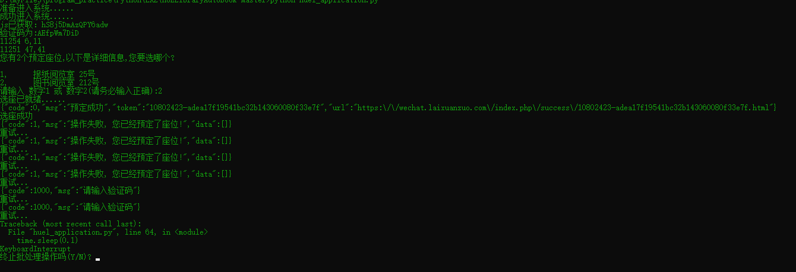

# OrdersetV2.0
来选座:理论上针对所有大学的选座

二次修改，增加了对于 所有绑定了学校的 来选座用户 提供了那两个预定座位的选座，理论上对于任何学校都可以。

但是我不可能一个个测过去+_+'',所以...

请自行配置beautifulsuop库，改动system_config中的wechatSESS_ID和设置选座时间(在system_book_timer.py)即可。

最后启动程序时最好不要距离抢座时间太远，因为wechatSESS_ID会在一段时间内失效，所以保证你wechatSESS_ID最新。

关于操作太频繁的出现图片验证码问题，原作者的GitHub提供的一种解决方案:用百度API来识别https://github.com/luoenen/AI-HUELSeat

我打算用ResNext解决这个问题，目前还在学习中，可能还有更新版本，以后再说！

告辞！！ 

2019.10.18

